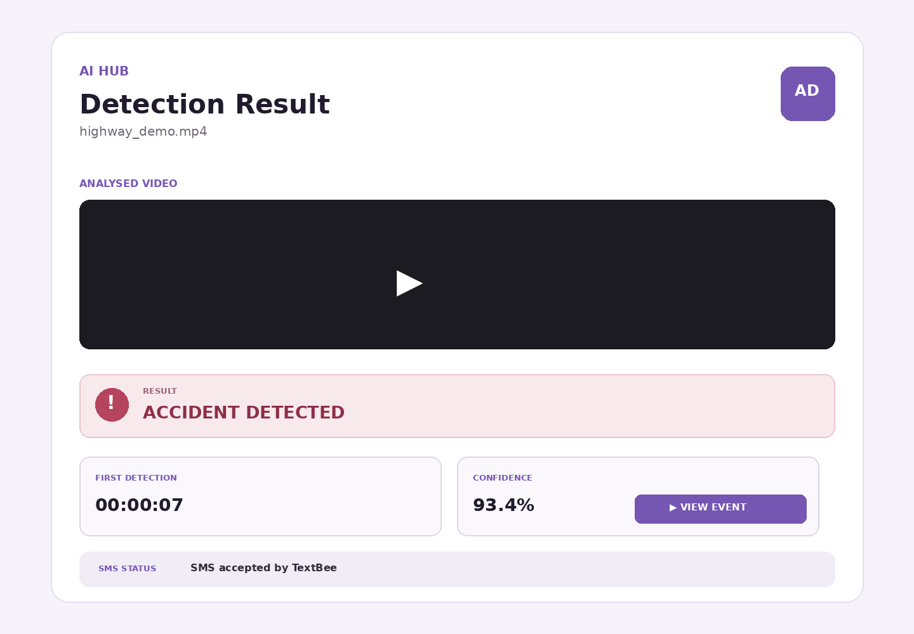

AI Hub — Hybrid Accident Detection Web System
AI Hub is a traffic-video accident detection project with two connected interfaces:
A cinematic 3D landing page that introduces the project.
A Flask web application where a user uploads a traffic video, runs the trained Hybrid detector, reviews the event result and snapshot, and checks the TextBee SMS alert status.
The detector combines YOLO11n road-object detection, ByteTrack tracking, motion and interaction features, CLIP scene features, a trained temporal TCN, and calibrated event-decision logic. The web interface calls this backend through `detector_adapter.py`; it does not use the earlier filename-based demonstration detector.
Features
Cinematic 3D landing page connected to the working Flask interface.
Upload support for MP4, AVI, MOV, MKV, and WEBM traffic videos.
Hybrid accident classification using the bundled trained models.
First-event timestamp and accident-frame snapshot generation.
TextBee SMS alert when the backend returns an accident result.
PDF-ready incident result page through the browser's Print/Save as PDF action.
Separate batch experiment automation with JSON logs and Excel/CSV reports.
CPU-oriented OpenVINO model artifacts included with the project.
Website snapshots
Video upload and detection page

Detection result page

How the web application works
```text
WEBB 02 landing page
        │
        └── Get Started
                │
                ▼
        Flask upload page
                │
        User selects a video
                │
                ▼
        detector_adapter.py
                │
                ▼
        HybridPipeline.run(video)
                │
        ┌───────┴────────┐
        │                │
     NORMAL          ACCIDENT
        │                │
        │         timestamp + snapshot
        │                │
        └──── result page┴── TextBee SMS status
```
Project structure
```text
AI_HUB/
├── app.py
├── detector_adapter.py
├── sms_adapter.py
├── requirements.txt
├── .env
├── .gitignore
├── README.md
├── static/
│   ├── WEBB 02.html
│   ├── style.css
│   └── assets/
│       └── aerial-road.webp
├── templates/
│   ├── index.html
│   └── result.html
├── screenshots/
│   ├── website-upload-current.png
│   ├── web_interface_upload.png
│   └── web_interface_result.png
├── uploads/
│   ├── *.mp4
│   └── snapshots/
│       └── *.jpg
└── AI_HUB_STAGE2_HYBRID_MODIFIED/
    ├── main.py
    ├── config.py
    ├── experiment_config.py
    ├── experiment_videos.txt
    ├── generate_report_only.py
    ├── requirements.txt
    ├── configs/
    │   └── default.yaml
    ├── hybrid/
    │   ├── __init__.py
    │   ├── backends.py
    │   ├── config.py
    │   ├── decision.py
    │   ├── motion.py
    │   ├── pipeline.py
    │   ├── semantic.py
    │   ├── temporal.py
    │   └── video.py
    ├── models/
    │   ├── hybrid.pt
    │   ├── clip.xml
    │   ├── clip.bin
    │   ├── temporal.xml
    │   ├── temporal.bin
    │   ├── temporal.metadata.json
    │   ├── clip_cache/
    │   └── yolo11n_openvino_model/
    │       ├── yolo11n.xml
    │       ├── yolo11n.bin
    │       ├── metadata.yaml
    │       └── precision.txt
    ├── postprocessing/
    │   ├── __init__.py
    │   ├── log_reader.py
    │   ├── metrics.py
    │   └── report_generator.py
    ├── result_logging/
    │   ├── __init__.py
    │   └── result_logger.py
    ├── logs/                       # Created/updated by batch runs
    ├── reports/                    # Created/updated by batch runs
    └── experiment_configurations/ # Saved configuration for each batch run
```
File and folder guide
Web application
File or folder	Purpose
`app.py`	Defines the Flask routes for upload, detection, uploaded videos, and snapshots. It calls the detector adapter and preserves the existing TextBee result flow.
`detector_adapter.py`	Loads the bundled Hybrid pipeline once and runs it for each uploaded video. It converts the model output into the fields expected by the result page and saves the first-event snapshot.
`sms_adapter.py`	Builds and sends an accident alert through the TextBee REST API. It reads the API key, recipient, and optional device ID from `.env`.
`requirements.txt`	Contains the combined dependencies for Flask, TextBee, OpenCV, PyTorch, OpenVINO, Ultralytics, CLIP, and reporting. Install this file before starting the web application.
`.env`	Stores local Flask and TextBee configuration. Treat this file as private and never commit or publish real API keys or phone numbers.
`.gitignore`	Lists local files that Git should ignore. Extend it if you add environments, generated reports, or private configuration files.
`static/WEBB 02.html`	Provides the cinematic 3D landing interface. Its Get Started button opens the Flask upload page at `http://127.0.0.1:5000/`.
`static/style.css`	Styles the upload page, result page, responsive layout, print view, and decorative road animation. It does not contain detection logic.
`static/assets/aerial-road.webp`	Supplies the light automotive background used by the redesigned upload interface. It is bundled locally so the upload page does not depend on an external image.
`templates/index.html`	Contains the Jinja/HTML upload form, preview player, and Run Accident Detection control. Its existing IDs and JavaScript connect the selected file to the Flask form.
`templates/result.html`	Displays normal/accident results, confidence when available, timestamp, snapshot, SMS status, and PDF/print action. It also lets the user jump the video to the event time.
`uploads/`	Stores videos submitted through the website. Existing sample videos are also included in this directory.
`uploads/snapshots/`	Stores event-frame images created after an accident is detected. Files are served through the Flask snapshot route.
`screenshots/`	Contains images used in this README and earlier interface references. These files are documentation assets and are not needed for inference.
Hybrid backend
File or folder	Purpose
`AI_HUB_STAGE2_HYBRID_MODIFIED/main.py`	Runs automated batch experiments from `experiment_videos.txt`. It initializes the Hybrid pipeline, processes each video, logs results, calculates metrics, and produces reports.
`config.py`	Defines Stage 2 project paths, model identity, sampling settings, and CPU thread settings. It points the batch runner to the active Hybrid configuration.
`experiment_config.py`	Builds the experiment name and configuration snapshot. These values help keep each automated run identifiable and reproducible.
`experiment_videos.txt`	Lists videos for batch automation using `video_path,label`. Blank lines and lines beginning with `#` can be used for spacing and comments.
`generate_report_only.py`	Regenerates reports from existing result logs without rerunning video inference. Use it when only the report output needs to be rebuilt.
`configs/default.yaml`	Contains the active detector, CLIP, temporal-model, sampling, threshold, voting, and event settings. Relative model paths are resolved from the backend folder.
`hybrid/backends.py`	Loads YOLO/OpenVINO and handles road-object detection and tracking. It also selects an available OpenVINO device with CPU fallback.
`hybrid/config.py`	Loads and validates `default.yaml` and resolves artifact paths. It also creates the feature signature checked against the trained temporal model.
`hybrid/decision.py`	Converts temporal probabilities into accident events using K-of-N entry, hysteresis exit, onset estimation, and event merging. It returns timestamps and event confidence.
`hybrid/motion.py`	Computes motion and interaction evidence from tracked road users. These features contribute to the temporal accident decision.
`hybrid/pipeline.py`	Orchestrates video decoding, object tracking, motion features, CLIP features, temporal prediction, and final event decisions. Its `HybridPipeline.run()` method is the web app's backend entry point.
`hybrid/semantic.py`	Creates normalized CLIP visual embeddings and compares them with road and collision prompts. It uses the included CLIP artifacts and cache.
`hybrid/temporal.py`	Defines the temporal fusion network and loads the trained checkpoint or compiled OpenVINO model. It produces accident probabilities for causal video windows.
`hybrid/video.py`	Decodes video frames using presentation timestamps and samples them at the configured rate. It reports source FPS, duration, decoded frames, and sampled frames.
`models/hybrid.pt`	Stores the trained Hybrid temporal checkpoint and its normalization/configuration metadata. The runtime validates it against the active feature configuration.
`models/clip.xml` and `clip.bin`	Store the OpenVINO representation and weights for the CLIP image encoder. They support CPU-oriented semantic inference.
`models/temporal.xml` and `temporal.bin`	Store the compiled OpenVINO temporal network and weights. `temporal.metadata.json` links this export to the trained checkpoint.
`models/clip_cache/`	Contains the frozen CLIP weight file expected by `open_clip_torch`. Keeping it local avoids downloading the model at inference time.
`models/yolo11n_openvino_model/`	Contains the OpenVINO YOLO11n detector, weights, and metadata. Ultralytics loads this directory for road-object detection and ByteTrack tracking.
`postprocessing/log_reader.py`	Reads the JSON result logs produced by automated experiments. It provides the normalized records used for metrics and reports.
`postprocessing/metrics.py`	Calculates confusion-matrix counts and classification metrics. Results include accuracy, precision, recall, F1, and specificity.
`postprocessing/report_generator.py`	Creates Excel and CSV summaries from experiment results and metrics. Generated reports are saved under a numbered report folder.
`result_logging/result_logger.py`	Saves one structured JSON result for every processed video. These logs are the source for post-processing and report generation.
`logs/`	Stores numbered batch-experiment result logs and Hybrid diagnostics. New runs create a new folder instead of overwriting an earlier experiment.
`reports/`	Stores generated Excel and CSV reports. The batch runner creates a matching report folder for each successful experiment.
`experiment_configurations/`	Stores the complete settings used for every numbered batch run. This makes later comparisons and report interpretation reproducible.
Requirements
Windows 10 or Windows 11.
64-bit Python 3.11 recommended.
VS Code with a PowerShell terminal.
Enough free disk space for the environment and bundled models.
Internet access while installing Python packages.
Internet access on the landing screen because its Three.js modules and demonstration car model are loaded from external CDNs.
A TextBee account, registered Android gateway device, active SIM, and API credentials if real SMS alerts are required.
The first detector request can take longer because the trained models must be initialized. Later requests in the same Flask process reuse the loaded pipeline.
Run the website in VS Code
Extract the project ZIP.
In VS Code, select File → Open Folder and open the extracted folder.
Open Terminal → New Terminal.
If the terminal is outside the `AI_HUB` folder, enter it:
```powershell
if (Test-Path .\AI_HUB\app.py) { Set-Location .\AI_HUB }
```
Create a local Python environment:
```powershell
& "$env:LOCALAPPDATA\Programs\Python\Python311\python.exe" -m venv .venv-local
```
Install the complete dependency list:
```powershell
& .\.venv-local\Scripts\python.exe -m pip install -r .\requirements.txt
```
Start Flask:
```powershell
& .\.venv-local\Scripts\python.exe .\app.py
```
Open the first interface:
```text
http://127.0.0.1:5000/static/WEBB%2002.html
```
Click Get Started, upload a traffic video, and select Run Accident Detection.
Press Ctrl+C in the VS Code terminal to stop the server.
Do not copy PowerShell prompt characters such as `PS>`, `>`, or `>>` into the terminal. If the terminal is stuck at `>>`, press Ctrl+C once and paste each command separately.
Configure TextBee SMS
Open `.env` and provide your own values:
```dotenv
FLASK_SECRET_KEY=replace-with-a-private-random-value
TEXTBEE_API_KEY=replace-with-your-textbee-api-key
TEXTBEE_DEVICE_ID=replace-with-your-device-id
TEXTBEE_RECIPIENT=+919876543210
```
Use the recipient's international E.164 format, including the leading `+` and country code.
`TEXTBEE_DEVICE_ID` may be left blank only when the TextBee account can choose the enabled/default device.
An SMS is attempted only when the Hybrid result is `ACCIDENT`.
A TextBee failure appears as an SMS error on the result page and does not discard the model result.
Never share or commit a populated `.env` file. Rotate any credential that has been accidentally published.
Run automated batch experiments
The web upload flow and batch automation use the same Hybrid backend, but they have different entry points. The web app calls `HybridPipeline.run()` through `detector_adapter.py`; batch automation uses the backend's `main.py`.
Add one video per line to `AI_HUB_STAGE2_HYBRID_MODIFIED/experiment_videos.txt`:
```text
C:\path\to\accident-video.mp4,accident
C:\path\to\normal-video.mp4,normal
```
Relative paths are resolved from the backend project. The label must be exactly `accident` or `normal`.
From the `AI_HUB` folder, run:
```powershell
Set-Location .\AI_HUB_STAGE2_HYBRID_MODIFIED
& ..\.venv-local\Scripts\python.exe .\main.py
```
Review the new numbered folders under:
```text
logs/
reports/
experiment_configurations/
```
The batch run creates JSON logs and Hybrid diagnostics, calculates TP/TN/FP/FN and classification metrics, and writes Excel/CSV reports only when every listed video is processed successfully.
Regenerate reports without rerunning inference
From `AI_HUB_STAGE2_HYBRID_MODIFIED`, run:
```powershell
& ..\.venv-local\Scripts\python.exe .\generate_report_only.py
```
This uses existing experiment logs. It is useful when detection is already complete and only the report files need to be recreated.
Supported web uploads
The Flask interface accepts these extensions:
```text
MP4 · AVI · MOV · MKV · WEBM
```
For reliable timestamps, use a valid video with decodable frames and monotonic presentation timestamps. Videos shorter than the configured temporal window may return an insufficient-evidence error.
Outputs
Output	Location
Uploaded web videos	`uploads/`
Web accident snapshots	`uploads/snapshots/`
Batch JSON logs	`AI_HUB_STAGE2_HYBRID_MODIFIED/logs/<experiment>/`
Hybrid diagnostics	`AI_HUB_STAGE2_HYBRID_MODIFIED/logs/<experiment>/hybrid_diagnostics/`
Excel and CSV reports	`AI_HUB_STAGE2_HYBRID_MODIFIED/reports/<experiment>/`
Saved run configuration	`AI_HUB_STAGE2_HYBRID_MODIFIED/experiment_configurations/<experiment>/`
Troubleshooting
`requirements.txt` or `app.py` cannot be found
The terminal is in the outer extracted folder. Run this first:
```powershell
Set-Location .\AI_HUB
```
PowerShell shows `>>`
PowerShell is waiting for an unfinished command. Press Ctrl+C, then paste one complete command at a time without copying any prompt symbols.
`ModuleNotFoundError`
Confirm VS Code is using `.venv-local` and reinstall the combined requirements:
```powershell
& .\.venv-local\Scripts\python.exe -m pip install -r .\requirements.txt
```
Port 5000 is already in use
An older Flask process may still be running. Return to its terminal and press Ctrl+C, then start this project again.
Landing page remains on the loading message
The landing animation loads Three.js, a Draco decoder, fonts, and its demonstration car model from external services. Check the internet connection, allow those CDN requests, and refresh the page; the Flask upload interface remains available at `http://127.0.0.1:5000/`.
Detection pipeline error
Confirm that `AI_HUB_STAGE2_HYBRID_MODIFIED/models/` is complete and that installation finished without errors. Also confirm the uploaded video is long enough and can be decoded normally.
SMS error
Verify the TextBee API key, recipient format, device ID, phone gateway status, SIM, permissions, and internet connection. The result page displays the TextBee error while retaining the accident result.
Security and privacy
Uploaded videos and generated snapshots remain on the machine under `uploads/` unless manually removed.
Traffic videos and snapshots may contain personal or identifying information; handle them according to the applicable privacy policy.
Keep `.env`, phone numbers, API keys, and gateway identifiers out of Git and shared archives.
Flask's development server is intended for local demonstration and development, not public production deployment.
Validate detector performance for the intended environment before relying on it for operational safety decisions.
Technology stack
Python 3.11 and Flask
OpenCV and PyAV
PyTorch and Torchvision
Ultralytics YOLO11n and ByteTrack
OpenVINO
OpenCLIP
NumPy, Pillow, PyYAML, and psutil
openpyxl for report generation
HTML, CSS, JavaScript, and Three.js for the interfaces
License and attribution
No project-specific license file is currently included. Before redistribution, add the intended license and verify the licenses and attribution requirements of the included models, datasets, libraries, Three.js assets, fonts, and external services.
Project status
This package is configured for local demonstration and evaluation. The landing interface, Flask upload flow, Hybrid backend, snapshot output, SMS integration, and batch experiment tooling are connected in one project.
